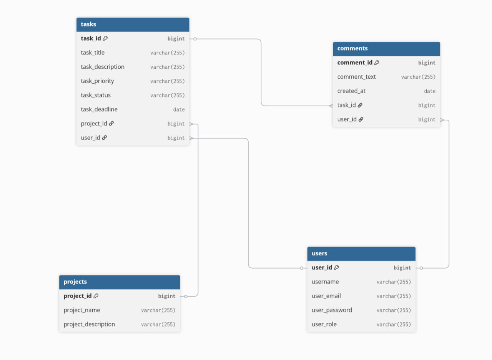

REST API for managing teams, users, tasks and comments.
Built with Spring Boot, Spring Security, PostgreSQL, Redis and Docker.

## Overview

Team Management System is a REST API application designed for managing teams and tasks inside an organization.

The system allows users to create tasks, assign them to team members, leave comments and track task statuses.

The project was created as a pet project to improve backend development skills and gain experience with Spring ecosystem technologies.

## Features

### User Management
- User registration
- User authentication with JWT
- Role-based access control

### Task Management
- Create tasks
- Assign tasks
- Change task status
- View active tasks

### Comments
- Add comments to tasks
- View task comments
- Delete comments

### Caching
- Redis integration
- Cached frequently accessed data

### Documentation
- Swagger/OpenAPI support
## Architecture

The project follows a layered architecture:

- Controller Layer
- Service Layer
- Repository Layer
- Database Layer

Additional components:

- Spring Security
- JWT Authentication
- Redis Cache
- PostgreSQL
## Technologies

- Java 21
- Spring Boot
- Spring Security
- Spring Data JPA
- PostgreSQL
- Redis
- Docker
- Mockito
- JUnit 5
- Swagger/OpenAPI
- Maven

## Database Schema



## API Documentation

Swagger UI:

http://localhost:8080/swagger-ui/index.html

## Run with Docker

1. Clone repository

```bash
git clone https://github.com/Aven1ght/TeamManagementSystem.git
```
2. Run containers
```bash
docker compose up -d
```
3. Start application
```bash
mvn spring-boot:run
```

## Testing

The project contains:

- Unit Tests
- Mockito Tests

Current coverage:
- 45+ tests
## What I Learned

Through this project I gained practical experience with:

- Spring Security
- JWT Authentication
- Redis Caching
- Docker
- Unit Testing with Mockito
